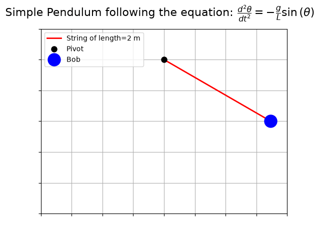
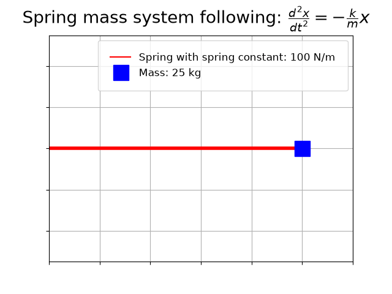
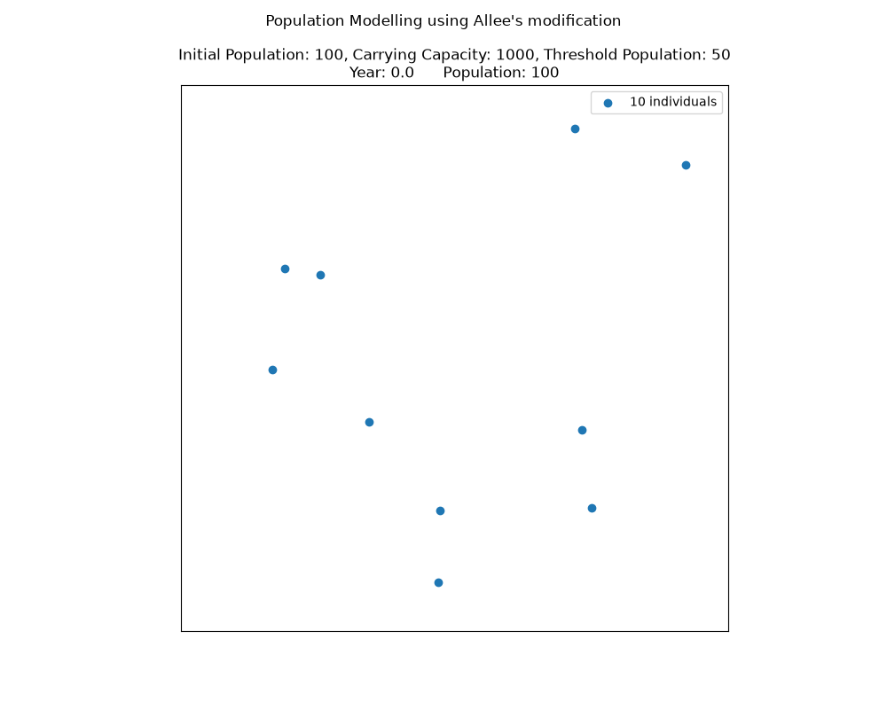
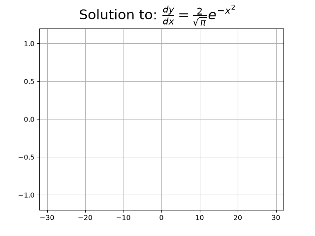

# Animation scripts

This directory turns numerical solutions from the project's [`solver.ivp`](../solver/README.md#initial-value-problems) module into interactive Matplotlib animations. Each script defines an ODE model, solves it with the from-scratch RK4 implementation, and maps the computed values onto moving plot elements with `matplotlib.animation.FuncAnimation`. The GIFs and MP4s in animations/ are pre-rendered. Scripts default to a live Matplotlib display rather than saving on every run, since saving costs more time and memory than most demo use needs — see [Exporting media](#exporting-media) if you want to save a modified animation.

## Gallery

<table>
  <tr>
    <td align="center">
      <strong>Simple pendulum</strong><br>
      
    </td>
    <td align="center">
      <strong>Spring–mass system</strong><br>
      
    </td>
  </tr>
  <tr>
    <td align="center">
      <strong>Population model</strong><br>
      
    </td>
    <td align="center">
      <strong>Error function</strong><br>
      
    </td>
  </tr>
</table>

The damped spring–mass demo is provided as an [MP4 video](animations/damped_shm.mp4).

## Available demonstrations

| Script | Model | Rendered media |
| --- | --- | --- |
| [`simple_pendulum.py`](simple_pendulum.py) | Nonlinear simple pendulum | [`simple_pendulum.gif`](animations/simple_pendulum.gif) |
| [`spring_mass.py`](spring_mass.py) | Undamped harmonic oscillator | [`spring_mass.gif`](animations/spring_mass.gif) |
| [`damped_shm.py`](damped_shm.py) | Damped harmonic oscillator with a position trace | [`damped_shm.mp4`](animations/damped_shm.mp4) |
| [`population_modelling.py`](population_modelling.py) | Population growth with the Allee effect | [`population_modelling.gif`](animations/population_modelling.gif) |
| [`erf.py`](erf.py) | Error function generated from its defining IVP | [`erf.gif`](animations/erf.gif) |

## Running an animation

First follow the root [installation instructions](../README.md#installation). They provide separate setup commands for Linux/macOS and Windows PowerShell.

Run a script from the repository root—for example:

```bash
uv run python animation_scripts/simple_pendulum.py
```

The command is the same on Linux, macOS, and Windows PowerShell. Replace `simple_pendulum.py` with any script from the table above.

If the project is installed in an activated virtual environment, run:

```bash
python animation_scripts/simple_pendulum.py
```

Each script opens an interactive Matplotlib window through `plt.show()`. A graphical Matplotlib backend is therefore required; the scripts do not write new media files when run in their current form.

## How the scripts work

Every demonstration follows the same pipeline:

```text
ODE and initial conditions
          ↓
   solver.ivp.rk4
          ↓
NumPy arrays of time and state
          ↓
FuncAnimation update callback
          ↓
Interactive Matplotlib window
```

The complete numerical solution is calculated before the animation starts. `FuncAnimation` then passes a frame index to an `update` function, which selects solution values and updates existing Matplotlib artists.

## Model details

### Simple pendulum

[`simple_pendulum.py`](simple_pendulum.py) solves the nonlinear pendulum equation

$$
\frac{d^2\theta}{dt^2}=-\frac{g}{L}\sin(\theta).
$$

The default model uses gravitational acceleration $g=9.81\,\mathrm{m/s^2}$, pendulum length $L=2\,\mathrm{m}$, an initial angle of $60^\circ$, and zero initial angular velocity. The animation converts the numerical angle into the Cartesian position of the string and bob.

### Undamped spring–mass system

[`spring_mass.py`](spring_mass.py) models simple harmonic motion:

$$
\frac{d^2x}{dt^2}=-\frac{k}{m}x.
$$

Its defaults are spring constant $k=100\,\mathrm{N/m}$, mass $m=25\,\mathrm{kg}$, initial displacement $x(0)=2$, and initial velocity $x'(0)=0$. The changing line width provides a simple visual representation of the spring as the mass oscillates.

### Damped spring–mass system

[`damped_shm.py`](damped_shm.py) adds viscous damping:

$$
\frac{d^2x}{dt^2}+\frac{c}{m}\frac{dx}{dt}=-\frac{k}{m}x.
$$

The defaults are $m=1\,\mathrm{kg}$, $k=4\,\mathrm{N/m}$, damping coefficient $c=0.5\,\mathrm{N\,s/m}$, initial displacement $x(0)=1$, and zero initial velocity. One subplot animates the mass while the other builds its displacement-versus-time trace.

### Population modelling

[`population_modelling.py`](population_modelling.py) uses the logistic model with the Allee effect:

$$
\frac{dP}{dt}=-rP\left(1-\frac{P}{K}\right)\left(1-\frac{P}{T}\right).
$$

The default parameters are growth rate $r=0.02$, carrying capacity $K=1000$, threshold population $T=50$, and initial population $P(0)=100$. One plotted marker represents ten individuals. Marker positions are generated with a seeded NumPy random-number generator, making the visual sequence reproducible.

The companion [`population_models.ipynb`](../analysis/population_models.ipynb) explains the exponential, logistic, and Allee-effect models in detail.

### Error function

[`erf.py`](erf.py) treats the error function as the IVP

$$
\frac{dy}{dx}=\frac{2}{\sqrt{\pi}}e^{-x^2}, \qquad y(0)=0.
$$

RK4 calculates the nonnegative half of the curve. The animation simultaneously draws the negative half using the odd symmetry $\mathrm{erf}(-x)=-\mathrm{erf}(x)$. The numerical data is subsampled before rendering to keep the animation concise.

See [`erf_function_using_ode.ipynb`](../analysis/erf_function_using_ode.ipynb) for the accompanying derivation.

## Customizing a demo

The model parameters are constants near the beginning of each script. Common adjustments include:

- Physical parameters such as `g`, `L`, `m`, `k`, or `c`
- Population parameters `r`, `K`, `T`, and `initial`
- Integration interval `a` to `b` and solver step size `h`
- `frames` and `interval` in `FuncAnimation`
- Plot limits, titles, colors, marker sizes, and figure dimensions

Keep requested frame indices within the length of the arrays returned by RK4. Smaller solver steps provide denser numerical data but require more calculations.

## Exporting media

The checked-in GIF and MP4 files live in [`animations/`](animations/). The scripts currently display their animations without saving them. To export a modified animation, insert an `anim.save(...)` call before `plt.show()`.

For GIF output:

```python
anim.save("animation_scripts/animations/output.gif", writer="pillow", fps=30)
```

For MP4 output:

```python
anim.save("animation_scripts/animations/output.mp4", writer="ffmpeg", fps=30)
```

GIF export requires Matplotlib's Pillow writer. MP4 export additionally requires an FFmpeg executable available on the system path. Choose a new output filename if the existing rendered media should be preserved.

## Dependencies

- [NumPy](https://numpy.org/) for model calculations, trigonometry, sampling, and random coordinates
- [Matplotlib](https://matplotlib.org/) for figures, artists, and `FuncAnimation`
- The local [`solver`](../solver/) package for RK4 integration

NumPy and Matplotlib are installed with the main project. FFmpeg is optional and needed only when exporting MP4 files.

## License

The scripts and rendered media are part of the project distributed under the [MIT License](../LICENSE).
